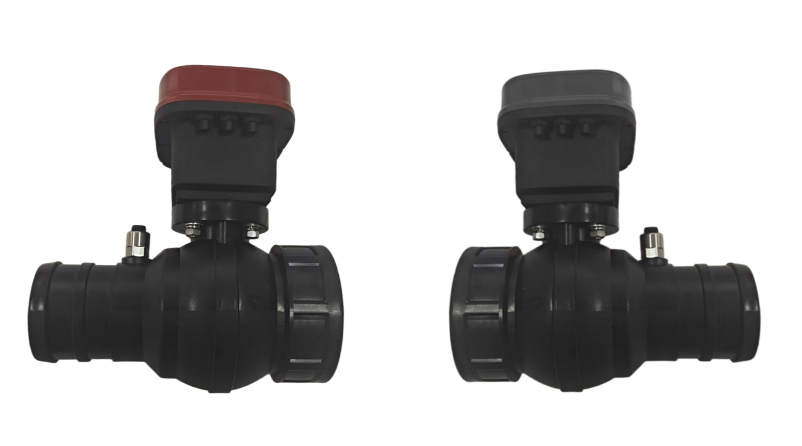

# 无三通双头阀 - 组装模板交付

## 产品模板

---

## 整机信息

| 字段 | 填写内容 |
|------|----------|
| **模板名称** | 慧飞金穗S14G 带手动 红色/1节21700/FP 双头球阀单头 入90内丝出90水带/压力×2，流量×0，无三通阀体转接件 |
| **设备类型** | 智慧球阀 |
| **设备型号** | A02100198-1568 |

---

## 元件组装表格

| 序号 | 模板项名称 | 组装事项 |
|------|------------|----------|
| 1 | 执行器 | (A02100110-0831) 慧飞 金穗S14G 带手动 红色/1节21700 |
| 2 | 从机部件 | (A02101099-1071) 慧飞 4G 多头阀从机 PP玻纤 1个4pin航空插头 1个6pin航空插头 黑色 485通讯 压力仪表 |
| 3 | 压力仪表 | (A02100102-1005) 慧飞 恒敏 压力仪 螺纹G1/4+M10-3PIN HM5200A |
| 4 | 压力仪表 | (A02100102-1005) 慧飞 恒敏 压力仪 螺纹G1/4+M10-3PIN HM5200A |
| 5 | 阀体 | (A02101098-1568) 慧飞 FP 双头球阀单头 入90内丝出90水带 无三通阀体转接件 |
| 6 | 阀体 | (A02101098-1568) 慧飞 FP 双头球阀单头 入90内丝出90水带 无三通阀体转接件 |
